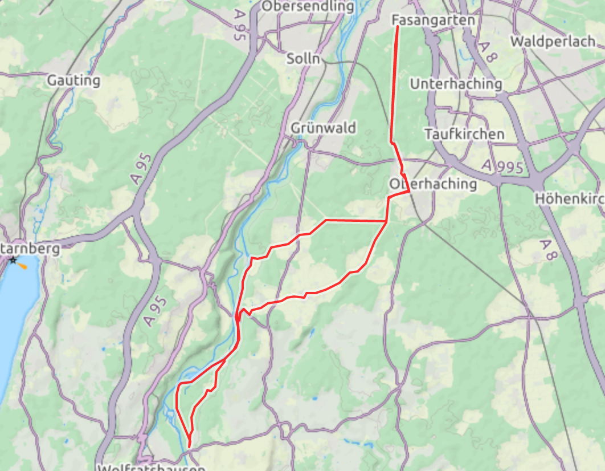
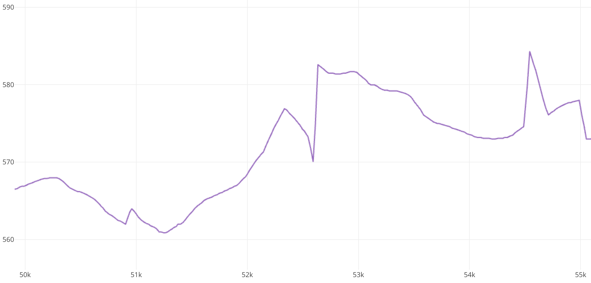
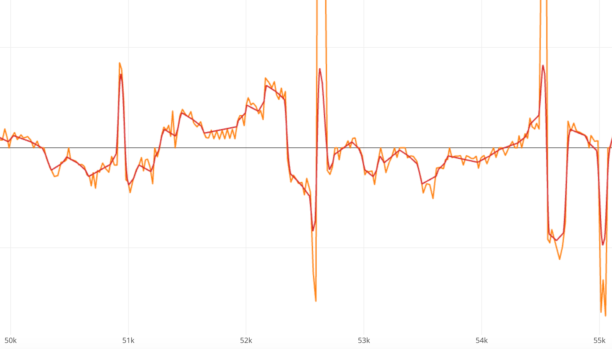
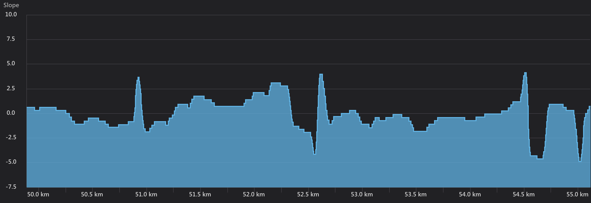

# GPX to Tacx Workout Converter

This project provides a web application that can take a GPS track recording and transform it into a free Tacx workout.

## Use it

To install all dependencies and build the web application, simply run `yarn install` or `npm install` within the project's root directory.

You might need to serve the application via installing `yarn global add http-server` and running `http-server .`

Now you will be able to access the application at http://localhost:8080/

## Conversion Process

A conversion happens in multiple steps. First of all the gpx track will be taken and split into segments. Each measured data point of the file will be transformed into a segment, which is defined by distance from start and altitude at that given point.

Then for each segment the slope is calculated as `[height difference] / [segment length]`. The orange line shows the raw slope segment data.

Afterwards this raw data is smoothened by calculating a BSpline function that converges towards the given points. The result can be found looking at the red line in the diagram below.

Eventually the slope segments are transformed into the Tacx format and transmitted to their cloud services. Now you will be able to train with it on your Tacx devices.

